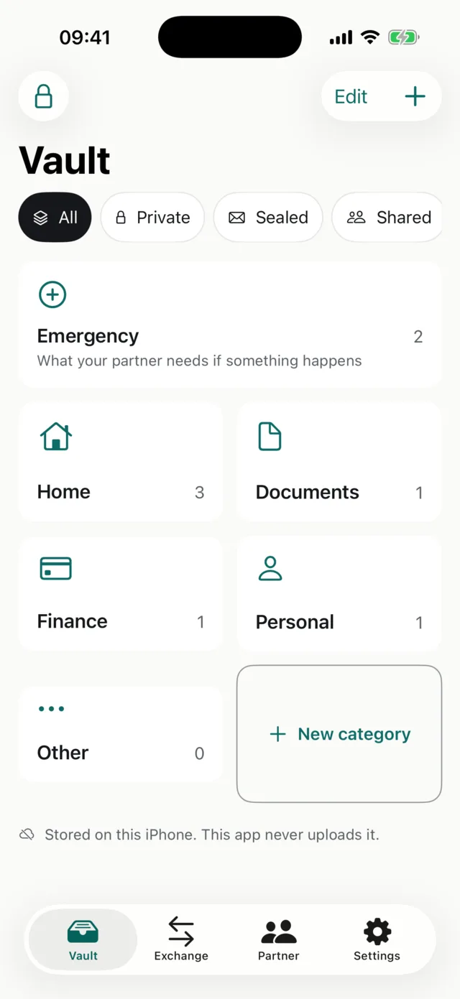
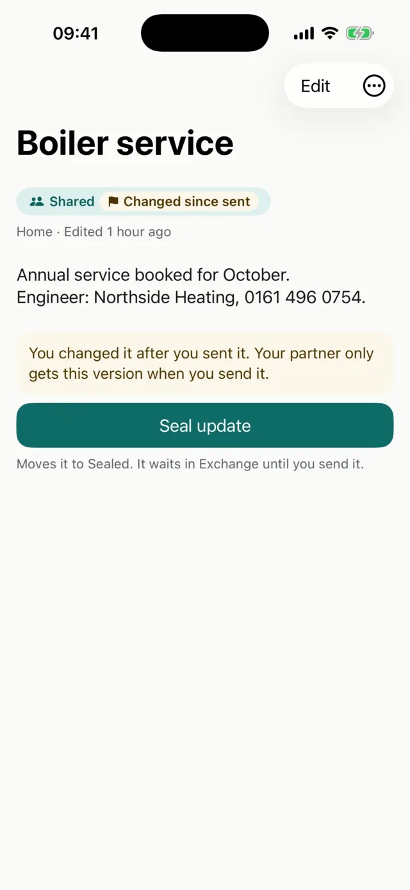
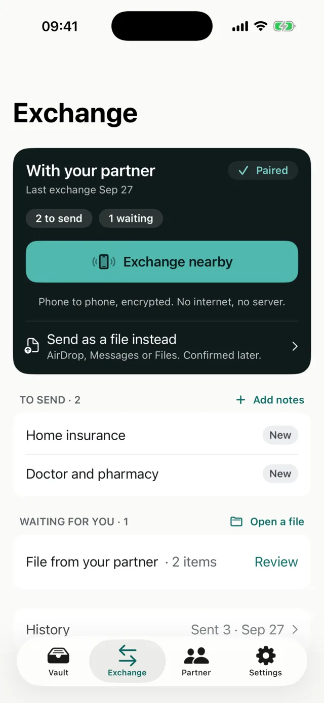
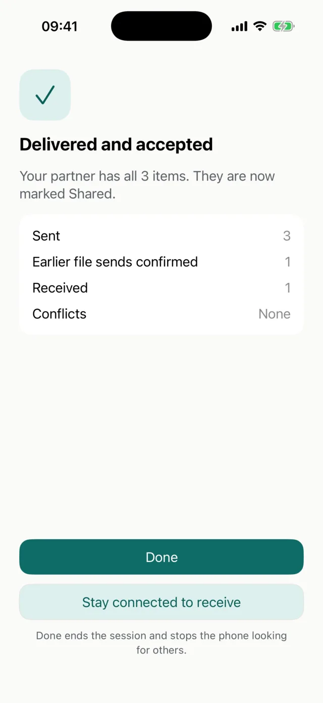

# Between Vault

**Private by default. Shared by choice. No cloud required.**

A notes vault for two people. It lives on your iPhones, and nothing leaves them unless you send it.

No server. No account. No analytics. No automatic sync. Open source.

  
  
  
  

Real screens from the app, with sample notes.

## What it is

* Two independent vaults, one per phone, joined by a single pairing
* Every note carries an explicit state: Private, Sealed, or Shared
* Sharing is an exchange. Side by side, the two phones connect directly, with no internet, and your partner accepts. Apart, one encrypted file you hand over yourself, through AirDrop, Messages or Files
* Works fully offline. Pairing and exchange never need a network

## How an exchange works

1. **Store.** Notes stay encrypted on your device.
2. **Seal.** Mark what your partner should have, then review exactly what leaves.
3. **Exchange.** Side by side, the phones connect directly (Exchange nearby); apart, one encrypted `.nvlt` file by AirDrop, Messages or Files. Either way your partner reviews, then accepts, and only then is it Shared. Import is atomic: all items land, or none do.

## Principles

* Nothing leaves a device unless its owner explicitly sends it
* Encryption happens before transport; the transport is never trusted
* No server dependency: there is no backend to breach or trust
* The exchange format is an open document, independent of the app's storage

## Security at a glance

* AES-GCM throughout: each record is encrypted at rest with a per device vault key, each exchange package is encrypted end to end under its own key, derived from the couple's pair key
* Pairing: QR handoff plus a six digit verification code, compared in person
* Exchange nearby: the two phones connect directly (peer to peer Wi-Fi, no internet, no server), only while the exchange screen is open, over TLS keyed from the pair key, so only the paired phone can connect. Nearby devices see only a random code, never a name
* Recovery: your partner holds an encrypted copy of your vault key, by design
* Honest limit: if both phones are lost and there is no backup, the data is gone. We cannot restore it, because we never had it

## Threat model

Protects against: a lost or stolen locked device, intercepted or tampered exchange files, wrong recipient, replay and duplicate imports.

No automatic sync, and one exception spelled out: when both of you open Exchange nearby, your phones tell each other which earlier files they imported (exchange IDs only, never content), so notes you sent as a file can show as confirmed. It happens only in a session one of you started.

Does not protect against: a fully compromised iOS installation, someone who knows your vault passcode, your partner (who can recover your vault by design), screenshots taken by the recipient.

## Protocol

The exchange package is a versioned format (`protocol_version = 1`). The full specification is in [PROTOCOL.md](PROTOCOL.md).

## Repository layout

* `web/` the website and waiting list
* `ios/` the iOS app (xcodegen project, SwiftUI, SwiftData)
* `.github/workflows/` deploys `web/` to GitHub Pages

Detailed specs and design files stay private and local, outside this repository.

## Status

In development. Website and waiting list: [Between Vault](https://neatnettech.github.io/between-vault/).

## Contributing

`main` is the trunk. Work on short lived `feat/`, `fix/` or `chore/` branches and
merge through a pull request with CI green. Releases are cut by tagging
`vX.Y.Z-rc.N` first, then promoting the accepted candidate to `vX.Y.Z` on the same
commit. See [CONTRIBUTING.md](CONTRIBUTING.md) for the full flow and the local
setup.

Found a security problem? Please report it privately. See [SECURITY.md](SECURITY.md).

Like the project? [Buy me a coffee](https://buymeacoffee.com/neatnettech) or [sponsor on GitHub](https://github.com/sponsors/neatnettech).

## License

GPLv3. See [LICENSE](LICENSE).
